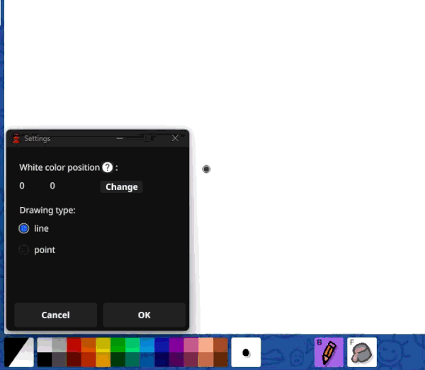

# Go-Skribbot

GUI auto-drawing tool for skribbl.io written in Go (Fyne). Search an image, click it, and the bot draws it for you.

## Features

- Easy initial setup for everyone.
- Images in different styles are searched for each search for the same word.
- Preview how the image will look.
- Stop drawing at any time using the Esc key.

## Usage

1) Open skribbl.io in a browser. Preferably a private room so you can test safely.

2) Launch Go-Skribbot and setup coordinates.
   - Click the gear button to open Settings.
   - Click "Change" under "White color position".
   - In your browser, move the mouse over the white color square on the palette and right-click. The app captures coordinates automatically.
   - Click OK to save.

    

3) In the main window, type a search query and click Search (or press Enter). A 2x3 grid will show matching images. (Repeat your search many times to get even more interesting results)

    

4) Click any image to start drawing. You have ~3 seconds to focus the browser window with the skribbl.io canvas.

    

5) Stopping (if needed):
   - Press Esc to stop immediately.

## Troubleshooting

- The drawing starts in the wrong place:
  - Re-capture coordinates from Settings and ensure the browser is on top when drawing begins.
  - Keep browser zoom at 100% and avoid moving the browser window between setup and drawing.

- Nothing happens when clicking an image:
  - Ensure PositionX and PositionY are set (Settings).
  - Some environments require running the app with appropriate permissions so it can control the mouse.

- Image search returns nothing or errors:
  - Try a different query. The app requests images from Google and may be affected by rate limits or network issues.

## Tech stack

- UI: Fyne (fyne.io/fyne/v2)
- Input automation: robotgo, gohook
- Config: cleanenv + YAML

## Disclaimer

This tool automates mouse/keyboard actions and fetches images from the web. Use responsibly and for personal/educational purposes. Respect game rules and third‑party content licenses.
